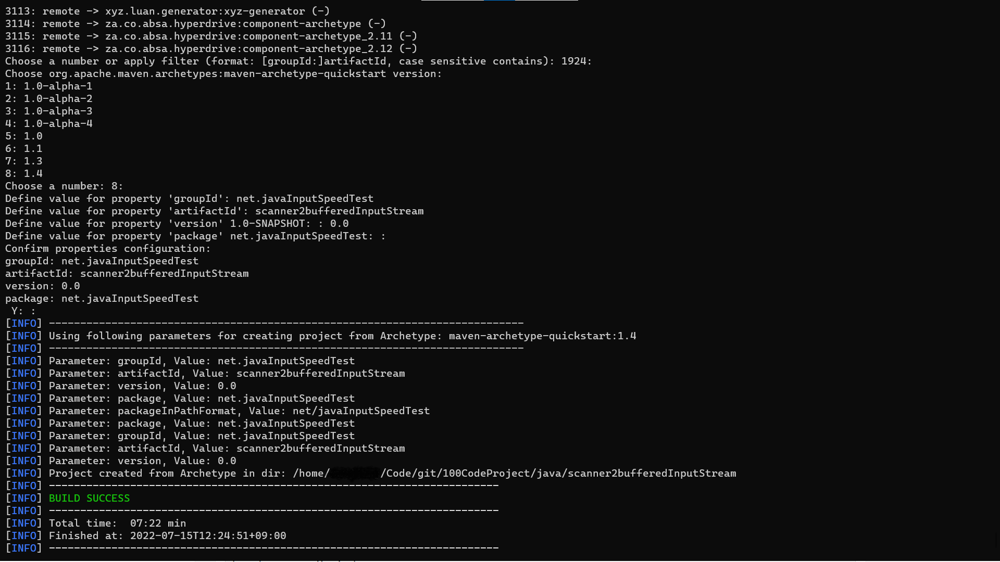

# Maven 공부
메이븐을 사용하는 법을 잊어버려서 다시 한번 사용하고자 여기다 정리한다.

## Maven 시작
mvn archetype:generate 명령어를 입력하면 프로젝트를 생성하는데 필요한 정보를 하나씩 입력해 나가면서 단계적으로 설정된다.

특별히 다른 설정을 하지 않는다면 아래와 같이 진행이 되는데
설명하자면 


* groupId - 프로젝트 속하는 그룹 식별 값. 회사, 본부, 또는 단체를 의미하는 값이 오며, 패키지 형식으로 계층을 표현한다. 주로 net.madvirus같은 형태로 groupId지정 하더라...
* artifactId - 프로젝트 결과물의 식별 값. 프로젝트나 모듈을 의미하는 값이 온다.
* version - 결과물의 버전을 입력한다. 기본 값은 1.0-SNAPSHOT로 되어있으며 원하는 버전으로 입력 하면 된다.
* package - 기본적으로 생성할 패키지를 입력한다. 별도로 입력하지 않을 경우 groupId와 동일한 구조의 패키지를 생성한다.

## 컴파일/빌드, 테스트, 패키지
### 테스트
빌드전 태스트를 해볼 수 있는 방법으로  
mvn test를 통해 실행 가능하며 테스트 코드들을 컴파일하고 실행한다.  
태스트 코드의 위치는 src안의 test폴더 안에 있다.

### 패키지
배포 가능한 실행파일을 만드는 것으로 바로 컴파일, 빌드 해주는 것이 아닌 라이프사이클에 따라서 작동한다. 물론 라이플 사이클을 설정 가능하지만 난 안할거다..

보통 compile -> test -> package-> install ?느낌으로 움직인다.

명령어는 mvn package이다.

### 오류
막상 package를 실행해서 target폴더네 jar파일이 만들어졌는데 실행이 안되고 "no main manifest attribute, in jar파일 이름" 이라는 오류를 내는데(안난다고?? 부럽군요....)

이는 main를 못찾는다는 이야기이다. 왜...???

일단 이를 해결하기 위해서는 maven을 설정할때 쓰는 pom.xml파일을 수정해 줘야 한다.

pom.xml파일 안의 build의 pluginManagement가 있고 그 안에 plugins이 있으며 그 안에는 다양한 plugin이 있는데(없을 수도 있는데 그러면 만들어주면 된다.) 그 안에 아래의 plugin을 넣어주면 된다.
``` xml
<plugin>  
    <!-- Build an executable JAR -->  
    <groupId>org.apache.maven.plugins</groupId>  
    <artifactId>maven-jar-plugin</artifactId>  
    <version>3.1.0</version>  
    <configuration>  
        <archive>  
            <manifest>  
                <mainClass>
                    (groupId).(main이 있는 class의 이름)
                    예시
                    groupId :net.madvirus
                    main이 있는 class의 이름 : App
                    이라 할때 net.madvirus.App 와 같이 작성해준다.
                </mainClass>  
            </manifest>  
        </archive>  
    </configuration>  
</plugin>  
```
하면 된다. 되나...?

### clean
초기화 하고 싶은때? package작업을 하여 프로잭트..?가 생성 되었는데 문제가 있어 수정을 하고 다시 할때 전에꺼가 말성이면 클린을 통해 지워주고 다시 실행하면 된다. 그때 사용되는게 clean이다.

mvn clean을 입력해보자