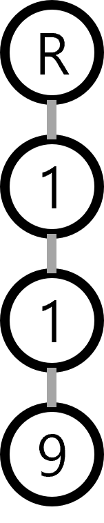
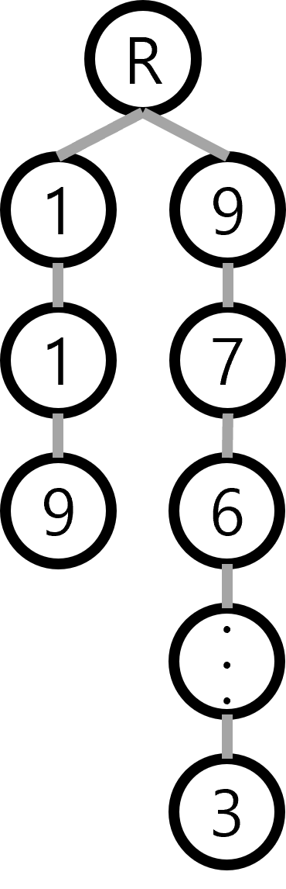
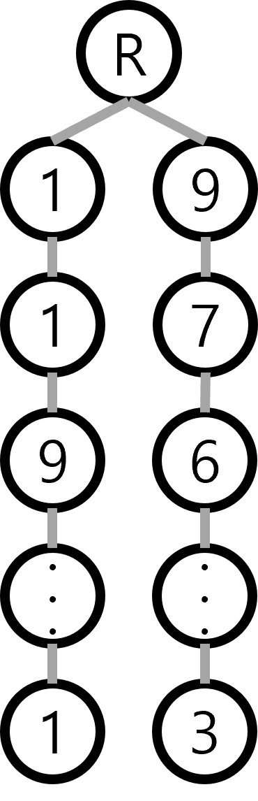

# Programmers[Lv2 전화번호 목록](https://programmers.co.kr/learn/courses/30/lessons/42577)
## 문제
 전화번호부에 적힌 전화번호 중, 한 번호가 다른 번호의 접두어인 경우가 있는지 확인하려 합니다.
 전화번호가 다음과 같을 경우, 구조대 전화번호는 영석이의 전화번호의 접두사입니다.

    구조대 : 119
    박준영 : 97 674 223
    지영석 : 11 9552 4421

 전화번호부에 적힌 전화번호를 담은 배열 phone_book 이 solution 함수의 매개변수로 주어질 때, 어떤 번호가 다른 번호의 접두어인 경우가 있으면 false를 그렇지 않으면 true를 return 하도록 solution 함수를 작성해주세요.

## 제한사항 
* phone_book의 길이는 1 이상 1,000,000 이하입니다.

    * 각 전화번호의 길이는 1 이상 20 이하입니다.
    * 같은 전화번호가 중복해서 들어있지 않습니다.


## 내 풀이
 트라이의 대표 문제라고 생각합니다.  
 예를들어 입출력 예제 1번처럼 ["119", "97674223", "1195524421"] 이 있다고 하자 그럼 첨음 119를 트라이에 적용하면 그림 1과 같이 될 것이다.  
 <p align="center">
 <p align="center">그림1</p>
 그 다음 전화번호인 97674223를 넣으면 
 <p align="center">
 <p align="center">그림2</p>
 그 다음 마지막번호인 1195524421를 넣었다 가정할때 완성된 모양은 
 <p align="center">
 <p align="center">그림3</p>
 처럼 될 것이다 이때 1195524421의 3번째 원소인 9를 추가할때 보면 해당 원소가 마지막원소(leaf)인 것을 알 수 있다. 즉 119라는 번호를 1195524421는 앞쪽에 가지게 되므로 접두어로 119는 1195524421의 접두어라는 것을 알 수 있다.

 하지만 1번의 예제의 리스트가 반대로 들어오게 된다면 1195524421와 97674223를 입력하는 동안 접두어가 안 나오므로 그림 3의 형태를 띄고, 그 뒤 마지막 값인 119가 들어오면 1-1-9까지 들어온 뒤 9에서 접두어 체크인 마지막원소인지 확인할 때 마지막 원소가 아니여서 119는 1195524421의 접두어인데 접두어가 있다는 것을 알지 못한다.  
 그럼 이 문제에 대한 해결방법이 무엇인가 하면 2가지가 있는데

 
 1. 길이기준으로 정렬을 한다.  
    길이 기준으로 오름차순으로 정렬을 하게되면 접두어가 되는 번호가 항상 먼저 들어오므로 접두어 체크가 가능하다.
 1. 전화번호를 트라이 트리에 다 넣고 번호 마지막 원소의 자식노드가 있는지 확인한다.  
    위의 1195524421가 먼저 들어오고 그 다음 119를 입력받는 상황에서 119의 9까지 입력 받고 9에 자식노드가 있으면 119이후로 무언가 더 이어진 전화번호가 존재한다는 뜻으로 119가 그 번호들의 접두어가 된다고 확인이 가능하다.

 아래 내 풀이는 2번을 이용한 방법이다. 1번 방법을 하고 싶으면 phone_book.sort()해주고 if(len(tmp)!=1):부분을 지워주면 된다. 둘다하면 속도 느려지니 둘중 하나만 하자...

## 구현([전체 코드 파일](/programmers/42577%EC%A0%84%ED%99%94%EB%B2%88%ED%98%B8/c.py))
``` python
def solution(phone_book):
    phone_book.sort()
    tree = {"end":False}
    for num in phone_book:
        tmp = tree
        for c in num:
            if(c not in tmp):
                tmp[c]={"end":False}
            if(tmp["end"]):
                return False
            tmp = tmp[c]
        if(len(tmp)!=1):
            return False
        tmp["end"] = True
    return True
```

## 잡담
아 트리를 원래 딕셔너리로 하는거 아닌데 난 이게 너무 편해서 이렇게 하게 되네..

뭐 좋지 아니한가? 이게 뭐 대형 프로젝트도 아니고 만약 대형프로젝트면 클레스에 딕셔너리 섞어서 쓰면 그만인 것을